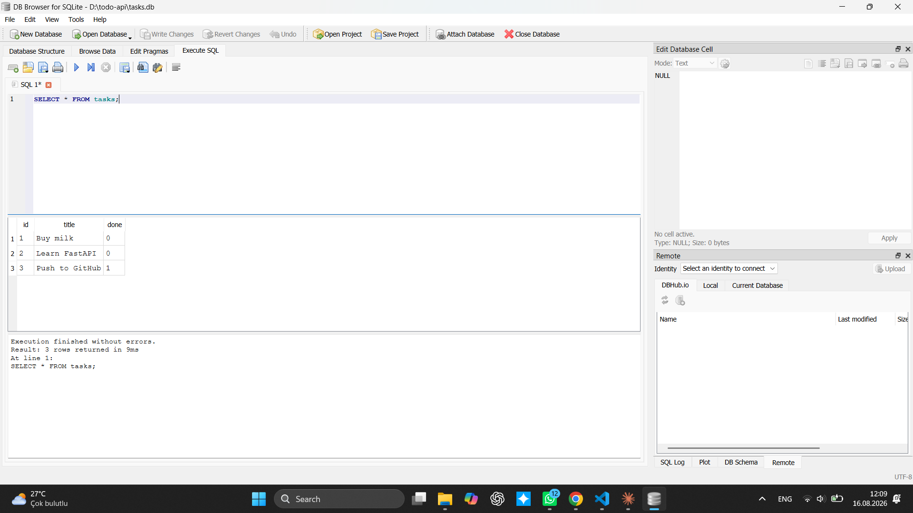
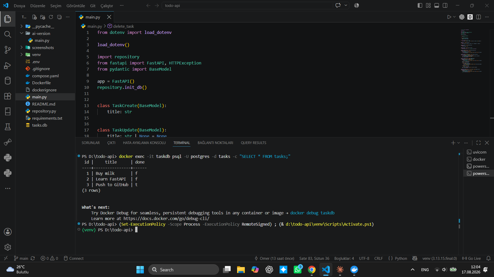

# Task API — CRUD API with FastAPI

A small REST API for managing a to-do list. Built with FastAPI as part of the FlyRank Internship, Backend Track, Week 2.

## How to run it

1. Clone the repo and enter the folder:
   ```bash
   git clone https://github.com/etikhacker/todo-crud-api.git
   cd todo-crud-api
   ```

2. Create and activate a virtual environment:
   ```bash
   python -m venv venv
   venv\Scripts\activate      # Windows
   source venv/bin/activate   # Mac/Linux
   ```

3. Install dependencies:
   ```bash
   pip install fastapi uvicorn
   ```

4. Start the server:
   ```bash
   uvicorn main:app --reload --port 8000
   ```

5. Open in your browser:
   - API: http://localhost:8000/
   - Swagger UI: http://localhost:8000/docs

## Endpoints

| Method | Path            | Description                        | Success | Errors   |
|--------|-----------------|-------------------------------------|---------|----------|
| GET    | `/`             | API info                            | 200     | —        |
| GET    | `/health`       | Health check                        | 200     | —        |
| GET    | `/tasks`        | List all tasks                      | 200     | —        |
| GET    | `/tasks/{id}`   | Get a single task by id             | 200     | 404      |
| POST   | `/tasks`        | Create a new task                   | 201     | 400      |
| PUT    | `/tasks/{id}`   | Update a task's title and/or done   | 200     | 400, 404 |
| DELETE | `/tasks/{id}`   | Delete a task                       | 204     | 404      |

## Example: curl -i

```
$ curl.exe -i http://localhost:8000/tasks

HTTP/1.1 200 OK
content-type: application/json

[
  {"id": 2, "title": "Learn FastAPI", "done": false},
  {"id": 3, "title": "Push to GitHub", "done": true}
]
```

## Swagger UI

All endpoints listed with their methods and descriptions:


Full CRUD cycle tested via "Try it out" — example of a successful `POST /tasks` (201 Created):


## Notes

- An empty body `{}` on `POST /tasks` returns **422** (FastAPI's built-in Pydantic validation for a missing required field), while `{"title": ""}` returns **400** (our own validation for an empty string). Both are treated as "invalid input" from the user's perspective.
- Task ids are assigned incrementally and are not reused after deletion.

## Database

Data is now stored in **SQLite** (`tasks.db`), not in memory — tasks survive a server restart.

- **Why SQLite:** single file, zero setup, no separate server needed — perfect for a small project like this.
- **Where it lives:** `tasks.db`, created automatically in the project folder on first run. It's git-ignored so every fresh clone starts with a clean seeded database.
- **How to run:**
```bash
  python -m venv venv
  venv\Scripts\activate       # Windows
  pip install fastapi uvicorn
  uvicorn main:app --reload --port 8000
```
- **Example query** (run in DB Browser):
```sql
  SELECT * FROM tasks WHERE done = 1;
```
  Returns only the completed tasks — currently `Push to GitHub`.



## Stage 6 — AI vs me

I asked Manus (AI agent) to independently migrate the same in-memory CRUD API to SQLite, without giving it my code. My prompt:

You have a FastAPI CRUD API that currently stores data in memory using a simple list or array, and you want to migrate it to SQLite. The stack should use Python, FastAPI, and the built-in sqlite3 library. Create a tasks table with the columns id, title, and done. If the table does not exist, it should be created automatically. If the table is empty, insert three sample tasks only once, so they are not added again after a restart. The same five endpoints—GET /tasks, GET /tasks/{id}, POST /tasks, PUT /tasks/{id}, and DELETE /tasks—must keep the same behavior. Return a 400 error when the title is empty and a 404 error when an ID is not found. All SQL queries must use parameterized statements, and user input must never be concatenated directly into SQL strings.

I put its output in `ai-version/main.py`, ran it against my own checkpoints, and diffed it against my hand-built version.

**What it did better:**
- Used FastAPI's `lifespan` context manager to run database setup on startup — a more current pattern than calling an init function at import time.
- Added a `CHECK (done IN (0, 1))` constraint at the database level, which I hadn't thought to add.
- Used `Depends()` for per-request database connections with a generator + `finally: close()`, which is cleaner resource handling than my open/close-per-call approach.

**What it got wrong or quietly changed (confirmed by running both versions):**
- `POST /tasks` returns **200** instead of the required **201** — no `status_code` was set on the route.
- `DELETE /tasks/{id}` returns **200 with a JSON body** instead of the required **204 with an empty body**.
- `PUT /tasks/{id}` requires both `title` and `done` in every request (422 if either is missing), breaking the partial-update behaviour my API and Assignment 1 both support.
- `GET /` and `GET /health` are missing entirely — they existed in Assignment 1 and should have carried over unchanged.
- Seeding logic differs in a subtle way: it uses `PRAGMA user_version` to seed only on the database's first-ever run, while my version (matching the spec's literal wording, "insert examples only if the table is empty") reseeds if every task is later deleted and the server restarts. I confirmed this by deleting all rows and reinitializing both versions — mine reseeded 3 tasks, Manus's stayed empty.
- Error messages were generated in Azerbaijani ("Task tapılmadı") instead of matching Assignment 1's English messages — a behaviour change my prompt didn't ask for.

**What my prompt forgot to specify:**
- I didn't state the exact success status codes (201 for create, 204 for delete), so the AI fell back to FastAPI's defaults.
- I didn't say whether `PUT` should support partial updates, so the AI required a full replacement instead.
- I didn't mention the `/` and `/health` endpoints at all, so the AI didn't know they needed to carry over.

**One rematch:** adding explicit status codes (201/204), a partial-update requirement for `PUT`, and a note to keep `/` and `/health` unchanged would likely close most of these gaps in a second pass.

## Running with Docker (Postgres)

One command starts the whole stack — app + database:

\`\`\`bash
cp .env.example .env
docker compose up
\`\`\`

Then open http://localhost:8000/tasks.

### Endpoints

| Method | Path          | Description        |
|--------|---------------|---------------------|
| GET    | /tasks        | List all tasks      |
| GET    | /tasks/{id}   | Get one task        |
| POST   | /tasks        | Create a task        |
| PUT    | /tasks/{id}   | Update a task        |
| DELETE | /tasks/{id}   | Delete a task        |

Example:
\`\`\`bash
curl -i http://localhost:8000/tasks
\`\`\`

### Persistence

Data lives in a Docker volume (\`taskdata\`). Verified by running \`docker compose down\` then \`docker compose up\` — the seeded and created tasks were still there afterward.

