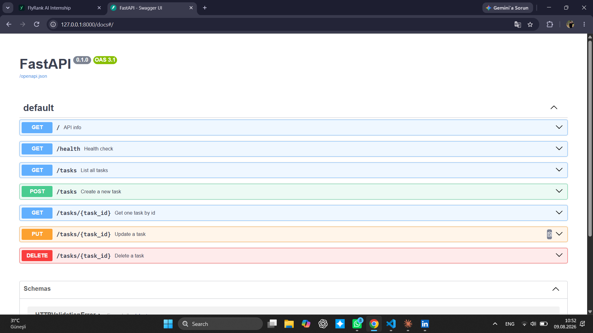
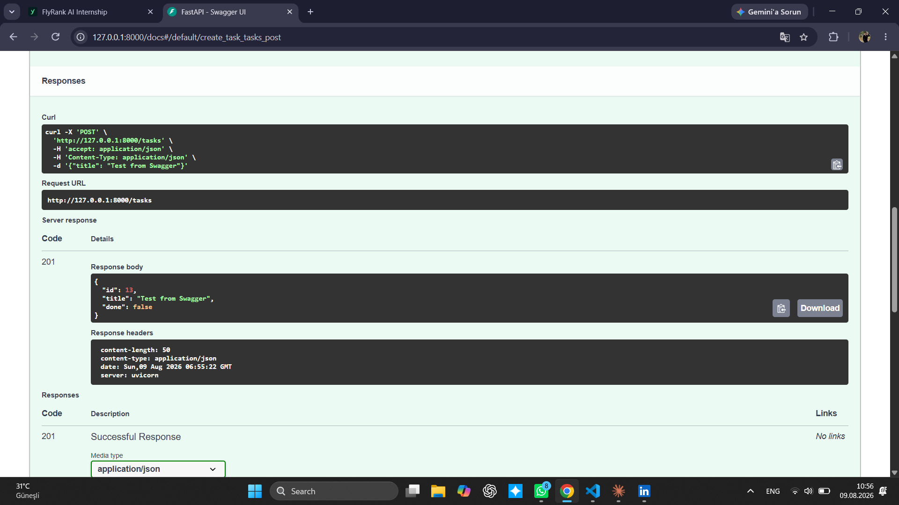

# Task API — CRUD API with FastAPI

A small REST API for managing a to-do list. Built with FastAPI as part of the FlyRank Internship, Backend Track, Week 2.

Data is stored **in memory** — there is no database, so all tasks are lost when the server restarts. This is intentional for this stage of the program.

## How to run it

1. Clone the repo and enter the folder:
   ```bash
   git clone https://github.com/etikhacker/todo-crud-api.git
   cd todo-crud-api
   ```

2. Create and activate a virtual environment:
   ```bash
   python -m venv venv
   venv\Scripts\activate      # Windows
   source venv/bin/activate   # Mac/Linux
   ```

3. Install dependencies:
   ```bash
   pip install fastapi uvicorn
   ```

4. Start the server:
   ```bash
   uvicorn main:app --reload --port 8000
   ```

5. Open in your browser:
   - API: http://localhost:8000/
   - Swagger UI: http://localhost:8000/docs

## Endpoints

| Method | Path            | Description                        | Success | Errors   |
|--------|-----------------|-------------------------------------|---------|----------|
| GET    | `/`             | API info                            | 200     | —        |
| GET    | `/health`       | Health check                        | 200     | —        |
| GET    | `/tasks`        | List all tasks                      | 200     | —        |
| GET    | `/tasks/{id}`   | Get a single task by id             | 200     | 404      |
| POST   | `/tasks`        | Create a new task                   | 201     | 400      |
| PUT    | `/tasks/{id}`   | Update a task's title and/or done   | 200     | 400, 404 |
| DELETE | `/tasks/{id}`   | Delete a task                       | 204     | 404      |

## Example: curl -i

```
$ curl.exe -i http://localhost:8000/tasks

HTTP/1.1 200 OK
content-type: application/json

[
  {"id": 2, "title": "Learn FastAPI", "done": false},
  {"id": 3, "title": "Push to GitHub", "done": true}
]
```

## Swagger UI

All endpoints listed with their methods and descriptions:



Full CRUD cycle tested via "Try it out" — example of a successful `POST /tasks` (201 Created):



## Notes

- An empty body `{}` on `POST /tasks` returns **422** (FastAPI's built-in Pydantic validation for a missing required field), while `{"title": ""}` returns **400** (our own validation for an empty string). Both are treated as "invalid input" from the user's perspective.
- Task ids are assigned incrementally and are not reused after deletion.